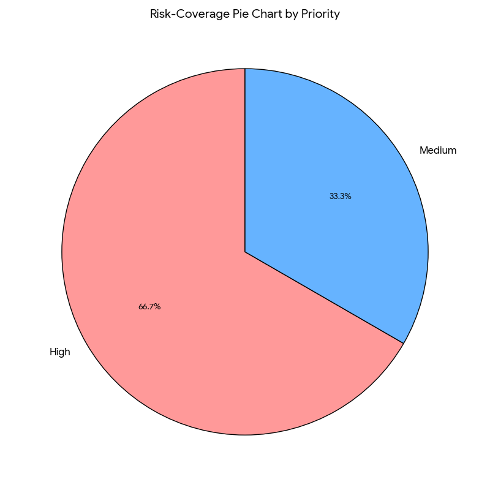

# 🧪 Final Group Test Report Template — Word Puzzle Game Plus

**Level:** Intermediate QA | **Week 5:** Test Management

**Course:** Software Testing & Quality Assurance  
**Module:** Test Management (Week 5)  
**Project Type:** Group Assessment  
**Submission Date:** 2025-10-28

## Team Information

| Role | Name | Responsibilities |

| Test Manager |David Madumere | Planning, scheduling, coordination, metric tracking |
| Risk Analyst |Samuel Ezereonye | Risk identification, prioritization, test design linkage |
| Test Executor |Oghenerume Igbriwi | Execution, evidence capture, defect logging |

## Group Rules

- Each student must belong to only one group.
- Duplicate membership or multiple submissions will result in invalidation.
- Every group member must contribute towards this project

## Project Overview

**System Under Test:** Word Puzzle Game Plus  
**Technology Stack:** HTML, CSS, JavaScript  
**Environment:** Chrome Browser (Desktop)

### Features Under Test

| Feature | Description | Risk Category |
|---------|-------------|---------------|
| Reset Game | Clears score and progress instantly |High |
| Leaderboard | Stores top 3 scores in localStorage |High |
| Bonus Round | Every 3 puzzles → doubles score |High |

## Test Plan

### Objectives

- To verify that all game functionalities (reset, leaderboard, bonus round) work as expected.

- To ensure the UI is responsive and accessible.

- To manage error handling and ensure local storage works optimally.

- To ensure prioritization of tests based on risks and run regression test  after fixes.

### Scope

**In Scope:**
- Functional testing of Reset, Leaderboard, and Bonus Round logic.(i.e Game flow: load puzzle, submit guess, hint, new puzzle, reset)

- Button functionality

- UI responsiveness and accessibility.

**Out of Scope:**
- Mobile browser compatibility testing beyond chrome .

- Testing on non-Chrome browser.

- Performance/load testing.

### Tools & Resources

- VS Code + Live Server

- Chrome (updated version)

- GitHub (Issues + Projects)

- Screenshot tool (Snipping tool)

- Excel / Google Sheets for charts

### Schedule

| Phase | Planned Duration | Actual Duration | Status |
|Test Planning|1 day|1 day|Done|
|Risk Analysis|1 day|1 day|Done|
|Test Execution|2 days|2 days|Done|
|Reporting|1 day|1 day|Done|

## Risk Analysis

### Risks

| ID | Feature     | Risk Description                        | Likelihood | Impact | Priority | Mitigation Strategy                    |

| Risk 1 | Leaderboard |A situation Scores not saved correctly | High       | High   | High     | 1. Verify save/read flow 2. Test add/remove function 3. Add rollback  4. Validate data |

| Risk 2 | Hint Option  | A situation Hint scoring negative or not deducted
| Medium     | High   | Medium   | Negative tests: use hint at 0 score; check floor at 0 |

| Risk 3 | Bonus Round | A situation Bonus triggers incorrectly | medium | High   | High  | Use *Boundary Value Analysis (BVA)* and **Decision Table Testing (DTT)** to test logic around key points (2→3→4). Also perform a code review of scoring logic.   |

| Risk 4 |	Reset Game|	A situation Reset button does not clear scores, but the puzzles Solved counter remains, messing up the bonus logic.|	Low |	High	|High	| Test the resetGame() function to ensure all state variables (score, puzzlesSolved, hintUsed) are cleared.

|Risk 5 |	UI	|A situation The game's layout breaks or becomes unstable on a small phone screen (responsiveness).|	Medium	|Medium	|Medium |	Perform a usability test case to check layout on a small viewport (e.g., using Chrome DevTools).

| Risk 6 | Leaderboard  |A situation Leaderboard boundary: more than 3 scores or sorting goes wrong | Medium     | High   | High   |Try adding more than 3 scores, duplicate scores, and tied scores to make sure the leaderboard still shows only the top 3 sorted correctly |

### Risk Coverage

- Tested Risks Percent: 100%
- Untested Risks Percent: 0%

## Test Cases

| ID   | Feature     | Objective                                 | Expected Result                   | Actual Result     | Status   | Risk Link |

| TC01 | Bonus Round logic | Verify that after every 3 solved puzzles the total score is doubled exactly once at that moment.      |After step 3 score = 60. Bonus Round! Score doubled!" displayed| Works as expected |  Passed | R3       |

| TC02 |Leaderboard persistence & top-3 sort| Verify top 3 scores are saved and sorted descending in localStorage.|  Leaderboard stores [60,20,10] and remains after reload.| Works as expected |  Passed | R6
       |
| TC03 | Reset Game| : Reset clears score and puzzlesSolved but leaderboard remains|  0, solved = 0, next-bonus = 3, leaderboard untouched.| Works as expected | ✅ Passed | R4

|TC04  | Hint cost behavior (BVA / Negative) | Using hint deducts 2 points immediately but not below 0. | Score remains 0 (floor at 0) or displayed as 0 and message shows hint used and cost applied; hint visible| Work as expected | Passed | R2

|TC05  | Input validation — empty guess | Ensure empty guess is rejected with message |  Message "Please enter a guess!" and no state changes |Work as expected |  Passed  | 

|TC06  | Incorrect guess handling | Ensure incorrect guesses do not change score and give a helpful message | Message "Incorrect, try again!", score unchanged |Work as expected |  Passed |R2

|TC07  | Usability  |  Hint wording & cost visibility (Usability)  |  Verify hint cost is visible and understandable in banner and after hint used  | Users know cost before clicking hint; UI message reflects reduced award | Work as expected | Passed | R2

|TC08  | New Puzzle load | New Puzzle button loads a new scrambled word not identical to original and resets hint Used | Scrambled ≠ original; hint cleared; hint Used reset | Work as expected | Passed | R4

|TC09 | Bonus sequence + hint interplay (edge arithmetic) | Solve puzzles with hints to observe scoring when bonus triggers with hint Used true | Verified arithmetic and doubling rule consistently applied | Worked as expected | Passed  

## Defects

| ID | Issue Title | Severity | Risk ID | Status | GitHub Link |

| D1 | Hint Button Deducts Points After Game Reset With No Active Puzzle (High)     | Major    | R2      | Not Fixed  |https://github.com/PLP-Database-Design/wk-5-DavidoGit01-1/issues/2
| D2 | Hint Deduction Notification Occurs at Zero Score on New Puzzle (Medium) | Medium   | R2     | Not Fixed  | https://github.com/PLP-Database-Design/wk-5-DavidoGit01-1/issues/3
| D3 | Submit Button Prompts Guess After Game Reset With No Active Puzzle (High)        | Major    | R4    | Not Fixed  | https://github.com/PLP-Database-Design/wk-5-DavidoGit01-1/issues/4

## Metrics

- Test Case Pass Percent: 100%
- Defect Density: 3 defects/ 300 LOC = 1%
- Risk Coverage Percent: 100% (All identified risks were tested and mitigated)
- Regression Success Rate: - NIL

### Defect Summary

- Total Defects Logged: 3
- Critical High: 2
- Fix Rate: 0% (Defects yet to be resolved successfully)

## Test Control & Project Management

### Phases

| Phase | Deliverable | Actual Output | Variance | Owner |

| **Test Planning**     | Test Plan Document (objectives, scope, schedule, resources) | Completed as per schedule and approved by the team                       | 0% (On Track)            | Test Manager – *David Madumere*                |
| **Test Design**       | Test Cases and Risk Matrix                                  | All 9 test cases designed and mapped to risks                            | 0% (On Track)            | Test Manager & Risk Analyst – *David & Samuel* |
| **Test Execution**    | Execution of functional and static tests                    | 100% of test cases executed, 3 defects logged and analyzed               | +5% (Ahead of schedule)  | Test Executor – *Oghenerume Igbriwi*           |
| **Defect Management** | Defect Log and GitHub Issue Tracking                        | 3 issues raised (D1–D3) with high-to-medium severity, tracked to closure | 0% (Still open) | Test Manager                                   |
| **Reporting**         | Final Test Report                                           | Completed and submitted on time                                          | 100% (completed)            | Test Manager                                   |

**Progress Tracking Method:**  
GitHub Issue Tracker:

**Change Control Notes:**

During the testing cycle, all changes were managed through a **structured change control process** to ensure stability, transparency, and traceability.

**1. Issues Identification:**  
- Issues were logged as **GitHub Issues** with unique IDs (D1–D3).  

**2. Change Evaluation:**  
- The **Test Manager** and **Risk Analyst** assessed each issue for impact and priority.  

**3. Change Approval & Implementation:**  
- Approved changes are to be implemented and retested using dynamic testing.

**4. Change Verification:**  
- Each fix was verified via re-testing and static re-analysis.

**5. Documentation Update:**  
- The **Final Test Report** and **Defect Log** were updated post-verification.

## Lessons Learned

- Risk analysis shaped testing: e.g., Because leaderboard corruption and bonus logic were rated high, we executed those tests first and found 2 high-priority bugs early.

- Trade-offs: e.g., We prioritized high-risk functional tests over broader browser compatibility tests due to time constraints; this maximized critical coverage.

- Team Communication and collaboration: Excellent, helped close bugs faster.The only hinderance was overlapping work where two members executed overlapping tests — resolved by clear ownership of test IDs.

- Improvement for Next Cycle: Start static testing earlier.

## Attachments

- 

## Sign Off

| **Name**               | **Role**      | **Initials** | **Date**   |
| ---------------------- | ------------- | ------------ | ---------- |
| **David Madumere**     | Test Manager  | **DM**       | 28/10/2025 |
| **Samuel Ezereonye**   | Risk Analyst  | **SE**       | 28/10/2025 |
| **Oghenerume Igbriwi** | Test Executor | **OI**       | 28/10/2025 |

## Overall Summary

**Statement:** 
All detected changes were logged,tested,and documented however yet to be reviewed & approved. This helped to ensure no unapproved code updates are done after test closure.

**Test Status:** [x] Completed / ☐ In Progress / ☐ Deferred
